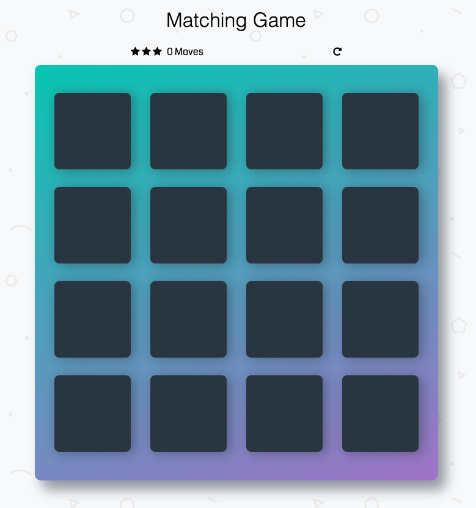
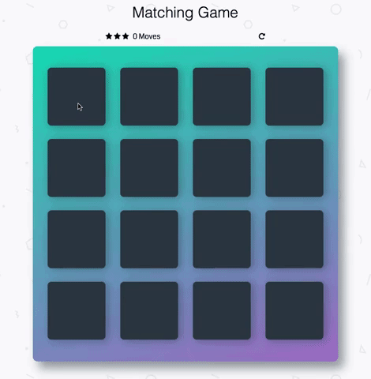
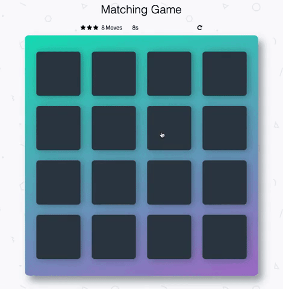
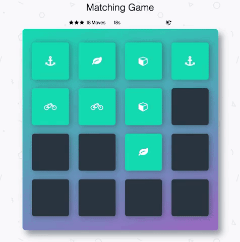
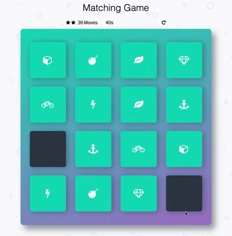
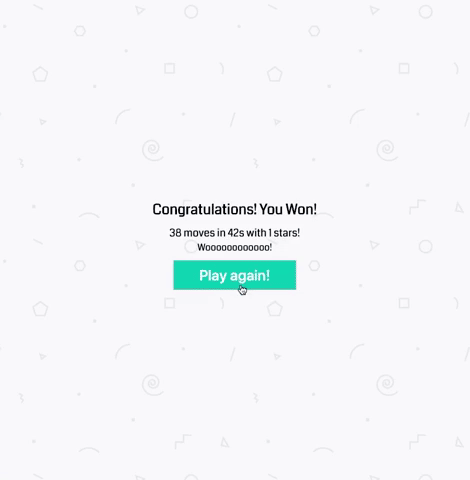

# Memory Game Project

## Table of Contents

1. [Description](#description)
2. [Instructions](#instructions)
3. [Contributing](#contributing)

## Description

This project is a memory game written in JavaScript, HTML and CSS. A four-by-four board of blank cards is presented to the player. The player can click on a card to reveal a symbol.  The symbol on each card matches that of another card on the board. The objective of the game is to find the matching card to each pair in the least amount of moves and time possible. If two cards do not match, they will shake, turn red, and flip back over. If they do match, they will turn turquoise, a wiggle-like animation will play and the cards will remain face up. Once all the card pairs are uncovered, the game is finished and a congratulatory modal will be displayed with the final game stats and a play again button.

### Game Play

#### Start of Game

#### Cards Do Not Match

#### Cards Match

#### Resetting the Game

#### Completed Game

#### Replaying

## Instructions

## Contributing

This repository is the starter code for _all_ Udacity students. Therefore, we most likely will not accept pull requests.

For details, check out [CONTRIBUTING.md](CONTRIBUTING.md).
